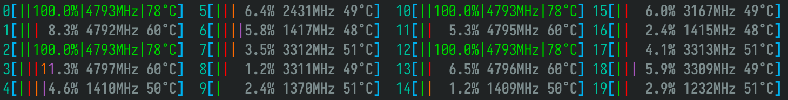
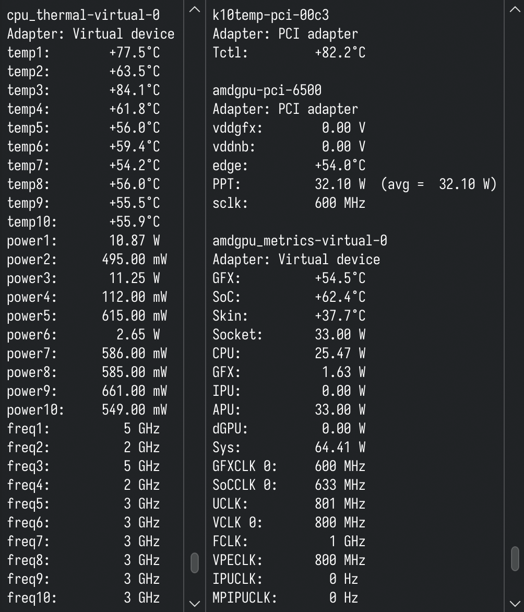

# HWMON driver for AMDGPU gpu_metrics

`amdgpu_metrics` is a Linux kernel module that provides the missing HWMON interface for Radeon GPUs and Ryzen APUs (CPUs with iGPU).

## Features



- Exports metrics (temperatures, power consumption, clock speeds) via HWMON interface
  - Compatible with standard monitoring tools like `(lib)sensors` (from `lm-sensors`)
- Exports GPU metrics for Radeon GPUs
- Exports iGPU metrics and per-CPU-core metrics for Ryzen APUs
  - Enables `htop` to properly show per-CPU-core temperatures
- Provides significantly more metrics than `amdgpu` and `k10temp`
- Tested on Radeon RX 7600, Ryzen AI MAX+ 395[^1], Ryzen AI 9 365, Ryzen 7 7840HS, Ryzen 5 5600G

## Installation & Usage



First, build the module and run userspace tests with

```sh
make modules test
```

If the module is successfully built and the test is successful, you can load the module with

```sh
make insmod
```

After loading the module, GPU metrics will be available through the hwmon interface,
typically at `/sys/class/hwmon/hwmon*/`. Use `sensors` to check these metrics conveniently.

The main HWMON device is called `amdgpu_metrics` (check with `hwmon*/name`).

If you have a Ryzen APU, you will also find a dedicated HWMON device called `cpu_thermal`,
exporting per-CPU-core temperatures, power consumption, and clock speeds. This enables `htop`
to properly show per-CPU-core temperatures.

## TODO
- `make install` to /usr/lib/modules/ and /etc/modules-load.d/
- DKMS support
- Multi-GPU support

## Disclaimer
This project is a proof of concept (PoC). It is neither for serious purposes nor affiliated with
AMD. It reads `/sys/class/drm/render*/device/gpu_metrics` from kernel space - if you feel
uncomfortable about this, go ask AMD why they don't export these metrics to HWMON themselves.

## License
```
HWMON driver for AMDGPU gpu_metrics
Copyright (C) 2025  Rongrong <i@rong.moe>

This program is free software; you can redistribute it and/or
modify it under the terms of the GNU General Public License
as published by the Free Software Foundation; either version 2
of the License, or (at your option) any later version.

This program is distributed in the hope that it will be useful,
but WITHOUT ANY WARRANTY; without even the implied warranty of
MERCHANTABILITY or FITNESS FOR A PARTICULAR PURPOSE.  See the
GNU General Public License for more details.

You should have received a copy of the GNU General Public License
along with this program; if not, see
<https://www.gnu.org/licenses/>.
```

[^1]: Per-CPU-core temperatures are unavailable. Thanks, AMD!
